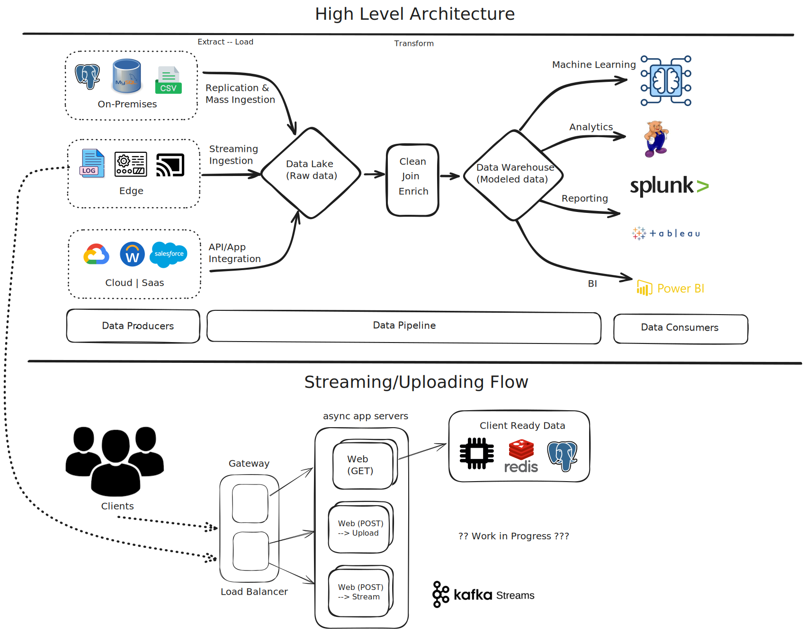

# Async ELT Pipeline

ELT Pipeline for ingesting raw data, scalable micro-service server apps for processing (via Kafka) and provide clean data downstream.


```code
Tech Stack:
 * Python3
    - FastAPI
    - Pydantic
    - Pandas
    - Pyiceberg
    - Pyspark
 * DataLake
    - Iceberg
 * Databases:
    - Redis
    - PSQL
```

Warning
    **THIS PROJECT IS CURRENTLY IN ALPHA:**

    - This is a WIP and so some features might be broken.
    - Backwards compatibility isnt garantueed.


## Design




## Developer

To setup for development, first run `make dev-setup`

Next we need to download the .tsv data from IMDB (https://datasets.imdbws.com/), place files in `data` directory and then populate our database:
```bash
## Get Source Data
# Supported IMDB File Names and location
data/title.basics.tsv

## Populate Redis
# Start fixtures will launch docker/docker-compose.yml
make start-fixtures
# Start the FastAPI web process
make run-web
# Populate redis-database
curl http://127.0.0.1:8000/movies/populate
# check data
curl http://127.0.0.1:8000/movie/Batman
```
Run tests:
```bash
make run-tests
```


